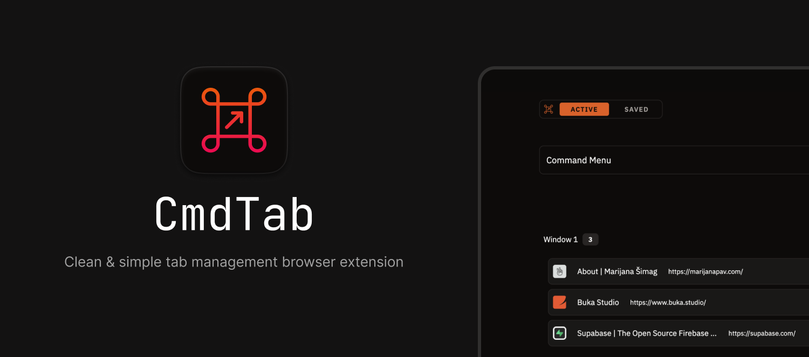

# EchoTab

## Overview

EchoTab is a tab management Chrome extension. It is built using [shadcn-ui](https://github.com/shadcn-ui/ui) and heavily utilizes [cmdk](https://github.com/pacocoursey/cmdk) for keyboard interactions.

### Installing

You can install the extension in a couple of ways:

#### Installing from the Web Store

-   [Chrome Web Store](https://chromewebstore.google.com/detail/cmdtab/cnhamlcjfdekdinhkfmllfdjamcncbkl)
-   Firefox Add-ons (soon)

#### Building from Source

After downloading the code, run the following commands:

```bash
npm install
npm run build
```

After obtaining the build, follow [these](https://developer.chrome.com/docs/extensions/get-started/tutorial/hello-world#load-unpacked) steps to add the extension to your browser:

1. Open the extensions page in Chrome (`chrome://extensions or edge://extensions`).
2. Enable Developer Mode.
3. Drag the downloaded build folder onto the extensions page to import it. Do not delete the folder afterward.

### Why yet another tab management extension?

Previously, I've used [OneTab](https://chromewebstore.google.com/detail/onetab/chphlpgkkbolifaimnlloiipkdnihall) and [Toby](https://chromewebstore.google.com/detail/toby-for-chrome/hddnkoipeenegfoeaoibdmnaalmgkpip) but wanted something in-between with the following characteristics:

-   No sign-up required for data import/export and other extra features.
-   Simple and clean UI.
-   Basic search/filtering capabilities.
-   Intuitive tagging with excellent keyboard support.
-   Smooth performance even with a large number (1000+) of saved tabs.

## Development

To set up the development environment, run the following commands:

```bash
npm install
npm run dev
```

### Generating a consistent development key

It's useful to have a consistent extension ID during development. One way to do it is by using the [Chrome Developer Dashboard](https://developer.chrome.com/docs/extensions/reference/manifest/key#keep-consistent-id) (it requires paying a 5$ fee, though).

You can also generate a key locally by following [these](https://stackoverflow.com/a/46739698) steps:

-   Generate keys:

```bash
openssl genrsa 2048 | openssl pkcs8 -topk8 -nocrypt -out key.pem

openssl rsa -in key.pem -pubout -outform DER | openssl base64 -A
```

-   Generate extension ID:

```bash
openssl rsa -in key.pem -pubout -outform DER | shasum -a 256 | head -c32 | tr 0-9a-f a-p
```

### Roadmap

Some features planned for future releases include:

-   AI powered auto-tagging

## License

Licensed under the [MIT license](https://github.com/shadcn/ui/blob/main/LICENSE.md).
